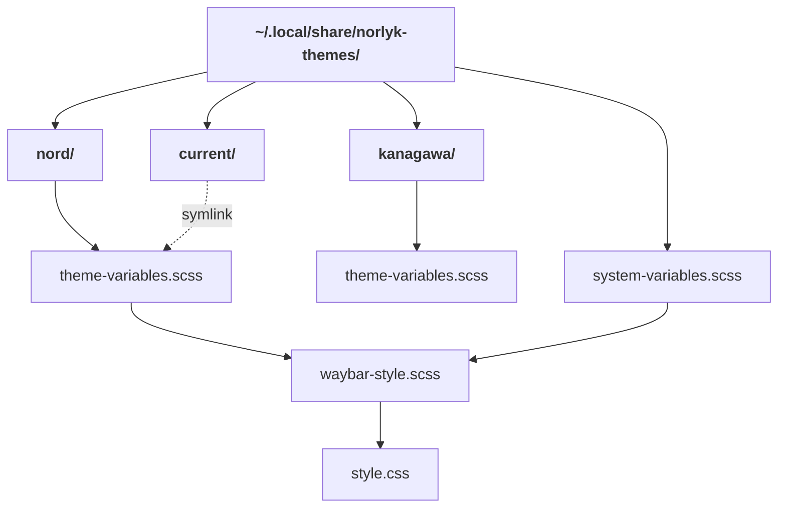
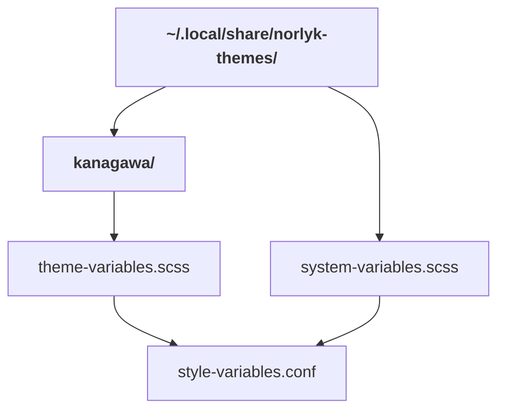

# Rust Theme Picker TUI

Terminal-based theme picker written in Rust.

## Tech stack

- Rust
- [Ratatui](https://ratatui.rs)

## Implementation

The themes are defined in `~/.local/share/norlyk-themes/`.

Each theme must include a use statement for the `system-variables.scss` and define the following variables:

```scss
// theme-variables.scss
@use "../system-variables";

$borderColor: rgba(220, 215, 186, 0.65);
$borderColorMuted: rgba(220, 215, 186, 0.45);
$borderColorInactive: rgba(220, 215, 186, 0.2);
$backgroundColor: rgba(31, 31, 40, 1);
$foregroundColor: rgba(220, 215, 186, 1);
$errorColor: rgba(232, 36, 36, 1);
$warningColor: rgba(255, 158, 59, 1);
$primaryColor: rgba(220, 165, 97, 0.8);
$secondaryColor: rgba(106, 149, 137, 1);
$ternaryColor: rgba(101, 133, 148, 1);
```

The theme picker updates the theme of several applications when switching.

### Waybar

To change the styling of Waybar, the theme picker first creates the `current/` directory, to preserve the file hieracy,
since `theme-variables.scss` contains the `@use "../system-variables";` statement with relative paths.

It then creates a symbolic link between the selected theme and `current/theme-variables.scss`.



The theme at `current/theme-variables.scss` is used by `waybar-style.scss`:

```scss
// waybar-style.scss
@use "current/theme-variables" as *;
@use "system-variables" as *;

window {
  color: $foregroundColor;
  font-size: 16px;
```

With the current theme in place the theme picker now compiles `~/.config/waybar/style.css` using
`~/.local/share/norlyk-themes/waybar-style.scss`.

## Hyprland

Hyprland is configured in `~/.config/hypr/hyprland.conf`, which has been extended to use a generated style file:

```
source = ~/.config/hypr/style-variables.conf

general {
  col.active_border = $borderColor
  col.inactive_border = $borderColorInactive
```

Using the selected theme, the theme picker generates a hyprland compatible config file:

```
// From the theme-variables.scss
$borderColor: rgba(220, 215, 186, 0.65);
$borderColorMuted: rgba(220, 215, 186, 0.45);

// To the style-variables.conf
$borderColor = rgba(46,52,64,0.65)
$borderColorMuted = rgba(46,52,64,0.45)
```

The theme picker also supports the `@use` statements from scss, which is why there must be a
`@use "../system-variables";` in each `theme-variables.scss` file.


